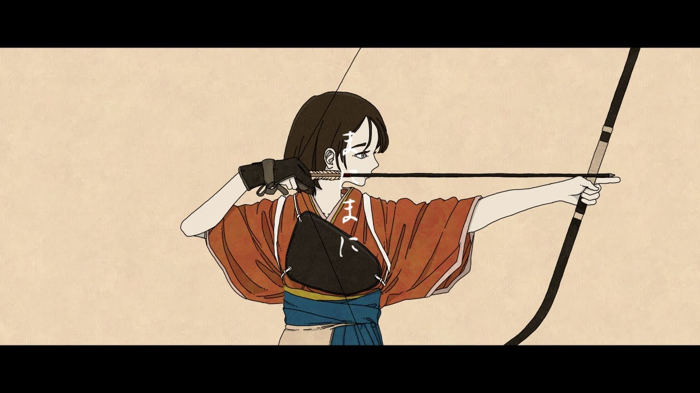

# Commlab page
 
 
<h2>2025.9-2025-12 projects</h2>
 

 
<h3>Projects</h3>

- [Project 2: ハローミューズ (Hello Muse)](https://tenmei-k.github.io/commlab-vsc/project2/)
         finals: Adapted for the Web

- [Project 1: Apocalypse X](https://tenmei-k.github.io/commlab-vsc/project1/)
         midterm: Shanzhai website

 
 
<h3>Exercises</h3>

- [clock](https://tenmei-k.github.io/commlab-vsc/clock/time.html)
         スター
- [DOM-Entropy](https://tenmei-k.github.io/commlab-vsc/DOM-Entropy/)
         「ハローセカイ」
- [lorem](https://tenmei-k.github.io/commlab-vsc/lorem/)
         Lorem ipsom dolor sitamet
- [third project](https://tenmei-K.github.io/commlab-vsc/250918/)
         fanart

<!--  
 
<h3>In class (real) tutorials</h3>

- [first website](https://tenmei-K.github.io/commlab-vsc/my-first-website/)
         strange/appropriate thing to do first day in school 
- [250922](https://tenmei-k.github.io/commlab-vsc/250922-ic/)
         techniques never used (by now)
- [tutorial-copy](https://tenmei-k.github.io/commlab-vsc/tutorial-copy/)
         should have something changed, but not found
- [css](https://tenmei-k.github.io/commlab-vsc/css-tests/)
         start of         
- [css-layout1](https://tenmei-k.github.io/commlab-vsc/css-layout1/)
         first step into         
- [css-layout2](https://tenmei-k.github.io/commlab-vsc/css-layout2/)
         second step 
        
- [tutorial](https://tenmei-k.github.io/commlab-vsc/tutorial/)
         confusing project full of ironic jokes about Gaokao-->