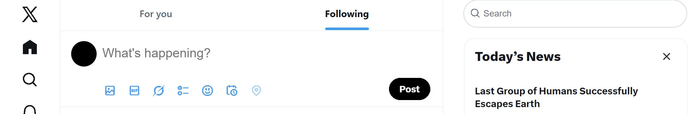
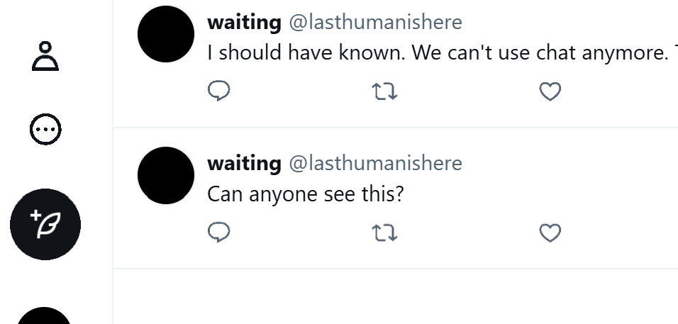

# Project 1:  Apocalypse X: The Last Ten Messages You Leave to the Universe
by X development group

 This is a project adapted from X that provides a roleplay experience.

The Earth has encountered a new virus that can't be eradicated with current technology.
 As the last group of human successfully escaped the Earth from the New Virus, X has announced that they will shut down Earth operations of this platform.
 However, somewhere on the Earth, there is a person posting on X, doing a countdown, and waiting to be found……

This is Aprocalypse X. Post to find another human on the Earth, post for your companied future, or post for your survival.

[Post on X now?](https://tenmei-k.github.io/commlab-vsc/project1/)
 
 
 
 
 
 
 
 

<h2>Developing Process</h2>
This website is adapted from X, which saves most of X's interaction and layout. In order to show the "Apocalypse" theme, the news are changed to made up ones to hint the context, while pages the side buttons link to are filled with sentence that the development group leave to users also leaving the Earth, replacing the usual functions. 
 
 The website's use of Gestalt Theory basiclly comes from the original layout of X. Similar sizes and hover effects have been used on buttons in a row, such as those on the left and the blue ones in the post input box. In addition, comments are arranged in the same layout, while text in one comment are closer to each other.
 X was supposed to be a very full website. The fact that the first page of my website is blank with the hint news on the side gives viewers a sense of uneasiness. Viewers are able to interact in the same way as they do on X, but the outcome of these interactions will be the same, no matter it's because I have set them as a designer, or I put nothing to interact more but a sentence to read on a linked page.
 
 In conclusion, this is a website that basically reached my expectations, but none of which in a perfect way. The layout doesn't fit every computer, and the content is quite thin. The center of my development shifted from content and layout to interaction during the process heavily, which resulted in a dilemma that I was on halfway to completing interaction that requires huge amount of work, but more time is needed to expand the story and roleplaying part. The feedbacks have provided precious inspirations: I will expand on how the comments work by nestling, and it's important to lead the viewers to click specific buttons, similar to some internet puzzle games. The linked pages could be designed more deliberately, and stories needs to be expanded. It also might be a great thought to lead viewers to explore "your" posts before the doomsday and after.
 
 No credits or references.