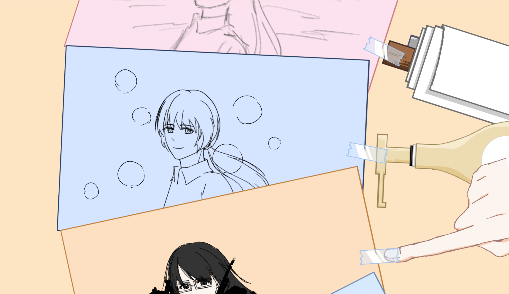
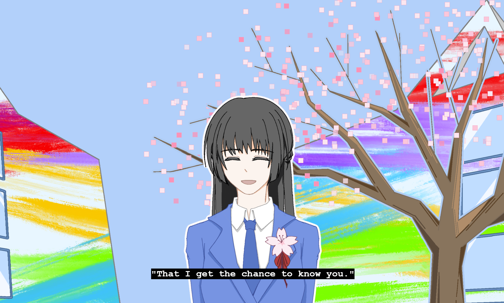

# Hello Muse
<h3>——web version of original story 我的大前辈离家出走了  by Tenmei</h3>
 
Hello Muse is the web version of an original story, telling stories that happened during a mysterious senior student’s stay in your house.  
The web version enhances interaction, visual, and hearing experience when revealing the real thoughts and emotions of characters through interactions including scrolling, clicking, hovering and others. The storyline was adapted to enhance comprehensibility and highlight parts that allows interaction. The purpose is to let viewers experience things originally described in text using eyes, ears, and hands.   
“Before every canva is created, who or what is the inspiration that pushes you to start a paint?" 
 

 
"Hello Muse, nice to meet you and see you again!”

